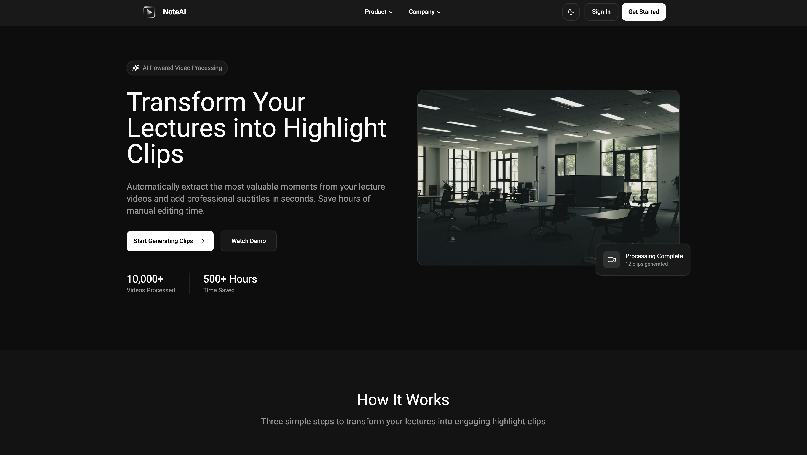
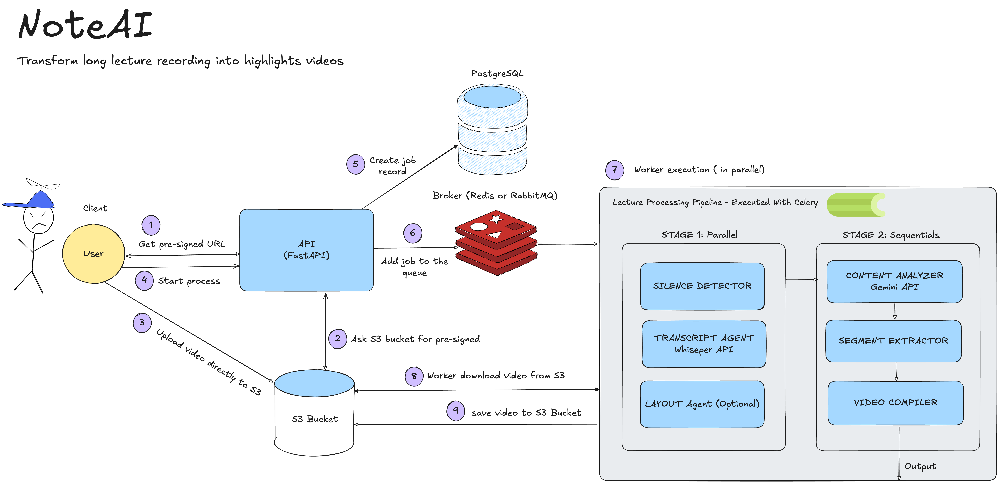

# NoteAI – Transform Long Lectures into Highlight Videos

**Team Project for CS1060**

> _NoteAI automatically transforms long lecture recordings into short, engaging highlight videos using multi-agent AI processing._

## Project Summary

NoteAI is a multi-agent AI pipeline that processes long lecture recordings (5–60 minutes) into concise video highlights (20s–2min each). The system identifies key educational moments, removes silence, and generates polished video summaries with subtitles, screen splits, and topic segmentation.

This project leverages distributed processing with Celery, integrates Google Gemini for content analysis, and uses OpenAI Whisper for transcription and subtitle generation.



## Table of Contents

1. [Overview](#overview)
2. [Architecture](#architecture)
3. [Tech Stack](#tech-stack)
4. [Features](#features)
5. [System Flow](#system-flow)
6. [Team Roles](#team-roles)
7. [Resources](#resources)
8. [Links](#links)

## Overview

**Input:**

- Lecture video or any other type of video (5+ min, with slides + camera)

**Output:**

- Multiple highlight clips (20s–2min each)
- Auto subtitles and timestamps
- Topic timeline visualization

**Value Proposition:**

- Saves time for students and instructors
- Auto-identifies key learning moments
- Professional, accessible output with subtitles
- Supports educational content re-use and accessibility with quizz and podcast features

## Architecture



### System Components

| Component                         | Description                                                                                                   |
| --------------------------------- | ------------------------------------------------------------------------------------------------------------- |
| **Frontend (React + TypeScript)** | Uploads lecture, displays real-time processing dashboard                                                      |
| **Backend (FastAPI + Celery)**    | Handles video processing and task orchestration                                                               |
| **AI Agents**                     | Gemini API (content analysis), Whisper (transcription), OpenCV (layout detection), MoviePy (video generation) |
| **Broker (Redis/RabbitMQ)**       | Queues processing jobs for distributed workers                                                                |
| **Database (PostgreSQL)**         | Stores job records, transcript metadata, and results                                                          |
| **Storage (AWS S3)**              | Stores uploaded and processed video content                                                                   |

### Database Schema


## Tech Stack

**Backend:**

- Python 3.9+, FastAPI, Celery, Redis, Pydantic
- PostgreSQL for production (SQLite for dev)

**Frontend:**

- React 18+, TypeScript, Vite, TailwindCSS
- React Query for data fetching

**AI/ML:**

- Google Gemini API (topic segmentation & scoring) for LLM and text-to-speech/speech-to-text models

**Infrastructure:**

- AWS S3
- Docker + Docker Compose for local orchestration
- Vercel for deployment

## Features

| Feature                        | Description                                    |
| ------------------------------ | ---------------------------------------------- |
| **Lecture Upload**             | Secure pre-signed S3 upload via FastAPI        |
| **Distributed Processing**     | Parallel + sequential AI pipeline              |
| **Smart Highlight Extraction** | Gemini-based topic segmentation                |
| **Silence Detection**          | Removes pauses using PyDub + librosa           |
| **Auto Subtitles**             | Whisper generates SRT/VTT captions             |
| **Results Dashboard**          | Real-time status updates via WebSocket         |
| **Export Options**             | Download clips individually or as full package |

## System Flow

1. **User Uploads Lecture** → React requests pre-signed URL
2. **FastAPI API** → Creates a processing job + S3 record
3. **Video Upload** → User uploads directly to S3
4. **Celery Worker** → Pulls job from Redis queue
5. **Stage 1 (Sequential)**
   - Upload Video
   - Silence Detector
   - Transcript Agent
   - Layout Agent (OpenCV)
   - Image Agent
   - Content Analyzer (Gemini)
   - Segment Extractor
   - Video Compiler
6. **Results Saved** → S3 + Database
7. **Frontend Dashboard** → Displays progress and results

## Team Roles

| Role                 | Member         | Responsibility                 |
| -------------------- | -------------- | ------------------------------ |
| **Project Lead**     | _Miranda Shen_ | Organization & scheduling      |
| **Product Lead**     | _Anay Patel_   | PRD ownership & requirements   |
| **Engineering Lead** | _Eliot Atlani_ | Backend & pipeline development |
| **Quality Lead**     | _Aaron Gong_   | Testing and QA                 |

## Resources

- **PRD (Product Requirements Document):** [Link to PRD](<[https://drive.google.com/drive/folder/...](https://drive.google.com/file/d/17IcuCqpmhBInQSeeHxLTP3FYMh7DeQI7/view?usp=drive_link)>)
- **Project Index Document:** [Link to Project Index](<[https://drive.google.com/drive/folder/...](https://docs.google.com/document/d/1Tju0ISCucELqwJ5BzRnwcWK9UDIXWhwrgyJk3jxe9co/edit?usp=sharing)>)
- **Team Google Drive Folder:** [Link to Design Folder](<[https://drive.google.com/drive/folder/...](https://drive.google.com/drive/folders/1_EZt-vSreHZA9UMcIAoyl-5W0WhwjE9Q?usp=drive_link)>)
- **Linear Project Board:** [Link to Linear Project](<[https://linear.app/...](https://linear.app/cs1060f25/team/NOTEAI/all)>)

## Getting Started

### Prerequisites

Before running the software, ensure you have installed:

- **Node.js** (v18 or higher) - [Download here](https://nodejs.org/)
- **Docker Desktop** - [Download here](https://www.docker.com/products/docker-desktop/)
- **Git** - [Download here](https://git-scm.com/downloads)

### Installation & Setup (Starting from Zero)

Follow these steps to install and run NoteAI on your local machine:

#### 1. Clone the Repository

```bash
git clone https://github.com/cs1060f25/noteai-project.git
cd noteai-project
```

#### 2. Set Up Environment Variables

**Backend:**

```bash
cd backend
cp .env.example .env
```

Edit `backend/.env` with required keys:

- **AWS**: `AWS_ACCESS_KEY_ID`, `AWS_SECRET_ACCESS_KEY`, `S3_BUCKET_NAME`, `AWS_REGION`
- **AI**: `GEMINI_API_KEY` ([get here](https://aistudio.google.com/app/apikey)), `OPENAI_API_KEY` ([get here](https://platform.openai.com/api-keys))
- **Auth**: `CLERK_PUBLISHABLE_KEY`, `CLERK_SECRET_KEY` ([get here](https://dashboard.clerk.com))

**Frontend:**

```bash
cd frontend
cp .env.example .env
```

Edit `frontend/.env`:

```bash
VITE_API_URL=http://localhost:8000/api/v1
VITE_WS_URL=ws://localhost:8000/ws
VITE_CLERK_PUBLISHABLE_KEY=pk_test_XXXXXXXXXXXXXXXXXXXXX
```

#### 3. Start the Backend

The backend uses Docker Compose to run PostgreSQL, Redis, and the FastAPI server.

```bash
cd backend
docker-compose up -d
```

This will start:

- **PostgreSQL** (database) on port 5432
- **Redis** (task queue) on port 6379
- **FastAPI API** on port 8000
- **Celery Worker** (video processing)

Verify the backend is running:

```bash
curl http://localhost:8000/health
```

You should see: `{"status": "healthy", "version": "0.1.0", "environment": "development"}`

#### 4. Start the Frontend

```bash
cd ../frontend
npm install
npm run dev
```

The frontend will be available at **http://localhost:5173**

### Using NoteAI

Once running, navigate to **http://localhost:5173**

**Typical User Flow:**

1. **Sign In** - Authenticate with Google OAuth (via Clerk)
2. **Upload Video** - Select lecture video (MP4, AVI, MOV) → uploads to S3
3. **Watch Progress** - Real-time updates via WebSocket (5 processing stages)
4. **View Results** - Watch highlight clips, read transcript, download content
5. **Explore Features** - Generate quiz, create podcast, export transcript, view AI summary

**Stop Services:**

```bash
# Backend
cd backend && docker-compose down

# Frontend
Ctrl+C in npm dev terminal
```

## Development Setup

### Git Hooks Installation

After cloning the repository, install git hooks to ensure code quality:

```bash
./scripts/install-hooks.sh
```

This installs a pre-commit hook that automatically:

- **Frontend**: Runs Prettier formatting, ESLint linting, and TypeScript type checking
- **Backend**: Runs Ruff linting and Black formatting

See `scripts/README.md` for more details.

### CI/CD Pipeline

**Continuous Integration:**

- Runs on every PR and push to `main`
- Checks: linting, formatting, type-checking, tests, build
- PRs cannot be merged unless all checks pass

**Continuous Deployment:**

- Deploys to Vercel automatically on merge to `main`
- Only deploys if CI passes
- See `DEPLOYMENT.md` for setup instructions

## Links

| Resource                | URL                                                                                                                                                                                |
| ----------------------- | ---------------------------------------------------------------------------------------------------------------------------------------------------------------------------------- |
| **GitHub Repo**         | [https://github.com/cs1060f25/noteai-project](https://github.com/cs1060f25/noteai-project)                                                                                         |
| **Google Drive Folder** | [https://drive.google.com/drive/folders/1_EZt-vSreHZA9UMcIAoyl-5W0WhwjE9Q?usp=drive_link](https://drive.google.com/drive/folders/1_EZt-vSreHZA9UMcIAoyl-5W0WhwjE9Q?usp=drive_link) |
| **Linear Project**      | [https://linear.app/cs1060f25/team/NOTEAI/all](https://linear.app/cs1060f25/team/NOTEAI/all)                                                                                       |

## License

© 2025 NoteAI Team – CS1060, Harvard University
Educational use only.
