# Construction Order Diagram

## AI Lecture Highlight Extractor - Numbered Architecture

```mermaid
graph TB
    %% Phase 1: Foundation (COMPLETED)
    subgraph "Phase 1: Foundation ✅"
        A1["1. Database Schema & Models<br/>PostgreSQL + SQLAlchemy"]
        A2["2. Backend API Framework<br/>FastAPI + Health Checks"]
        A3["3. Authentication System<br/>JWT + User Management"]
        A4["4. File Upload & S3<br/>Secure Upload Flow"]
    end

    %% Phase 2: Core Infrastructure (COMPLETED)
    subgraph "Phase 2: Core Infrastructure ✅"
        B5["5. Job Queue System<br/>Celery + Redis"]
        B6["6. Basic API Endpoints<br/>CRUD Operations"]
        B7["7. Docker Environment<br/>8 Services"]
        B8["8. Monitoring Stack<br/>Prometheus + Grafana + Loki"]
    end

    %% Phase 3: Processing Pipeline (IN PROGRESS)
    subgraph "Phase 3: Processing Pipeline 🔄"
        C9["9. AI Agent Framework<br/>6 Agent Structure"]
        C10["10. Stage 1 Parallel Agents<br/>Silence + Transcription + Layout"]
        C11["11. Stage 2 Sequential Agents<br/>Content + Segment + Video"]
        C12["12. Pipeline Orchestration<br/>End-to-End Workflow"]
    end

    %% Phase 4: User Experience (PLANNED)
    subgraph "Phase 4: User Experience 📋"
        D13["13. Frontend Foundation<br/>React + Auth + Routing"]
        D14["14. Upload Interface<br/>File Upload + Progress"]
        D15["15. Results Dashboard<br/>Highlights Display"]
        D16["16. Real-time Updates<br/>WebSocket Integration"]
    end

    %% Phase 5: Production Readiness (PLANNED)
    subgraph "Phase 5: Production Readiness 📋"
        E17["17. Testing Suite<br/>Unit + Integration + E2E"]
        E18["18. Security Hardening<br/>Rate Limiting + Auth"]
        E19["19. CI/CD Pipeline<br/>Automated Deploy"]
        E20["20. Production Deploy<br/>Kubernetes + Monitoring"]
    end

    %% Dependencies
    A1 --> A2
    A2 --> A3
    A3 --> A4
    A4 --> B5
    B5 --> B6
    B6 --> B7
    B7 --> B8
    B8 --> C9
    C9 --> C10
    C10 --> C11
    C11 --> C12
    C12 --> D13
    D13 --> D14
    D14 --> D15
    D15 --> D16
    D16 --> E17
    E17 --> E18
    E18 --> E19
    E19 --> E20

    %% Critical Path Highlighting
    classDef critical fill:#ff6b6b,stroke:#d63031,stroke-width:3px
    classDef completed fill:#00b894,stroke:#00a085,stroke-width:2px
    classDef inProgress fill:#fdcb6e,stroke:#e17055,stroke-width:2px
    classDef planned fill:#74b9ff,stroke:#0984e3,stroke-width:2px

    class A1,A2,A3,A4,B5,B6,B7,B8 completed
    class C9,C10,C11,C12 inProgress
    class D13,D14,D15,D16,E17,E18,E19,E20 planned
    class C10,C11 critical
```

## Critical Path Analysis

### **Bottleneck: AI Agents (Items 10-11)**
The AI agent implementation is the critical path that blocks all subsequent development:

- **Stage 1 Parallel Agents** (Item 10): Silence Detection, Transcription, Layout Detection
- **Stage 2 Sequential Agents** (Item 11): Content Analysis, Segment Extraction, Video Compilation

### **Parallel Work Opportunities**

While AI agents are being developed, these can proceed in parallel:
- Frontend mockups and component structure
- Testing framework setup
- Documentation writing
- CI/CD pipeline configuration
- Security hardening research

### **Foundation Dependencies**

Items 1-8 form the foundation that everything else builds upon:
1. Database must exist before any data operations
2. API framework must exist before endpoints
3. Authentication must exist before protected routes
4. File upload must exist before processing
5. Job queue must exist before async processing
6. Monitoring must exist for production readiness

### **Team Assignment Strategy**

**Sprint 1 (Nov 1-12): AI Agents Focus**
- **AI/ML Specialist**: Items 10-11 (critical path)
- **Backend Developer**: Item 12 (orchestration)
- **Frontend Developer**: Item 13 preparation
- **Foundation Person**: Infrastructure optimization

**Sprint 2 (Nov 13-26): User Experience**
- **Frontend Developer**: Items 13-16
- **Backend Developer**: WebSocket integration
- **AI/ML Specialist**: Agent optimization
- **Foundation Person**: Items 17-18 preparation

**Sprint 3 (Nov 27-Dec 9): Production Ready**
- **All Team Members**: Items 17-20 + presentation prep
